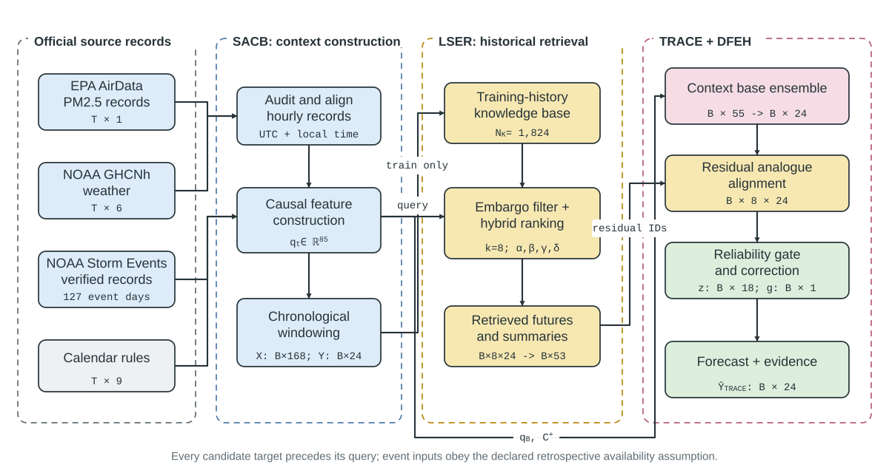
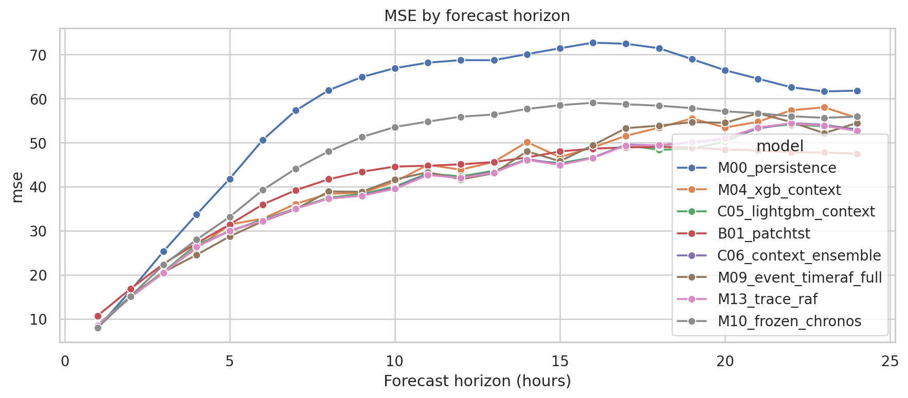
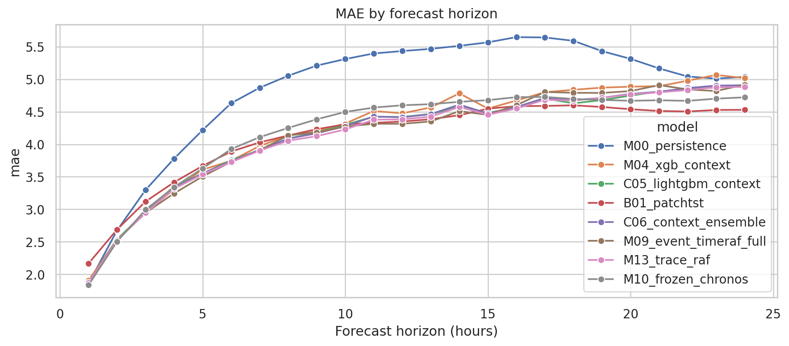
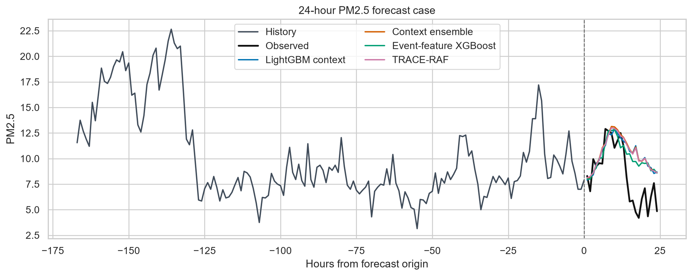
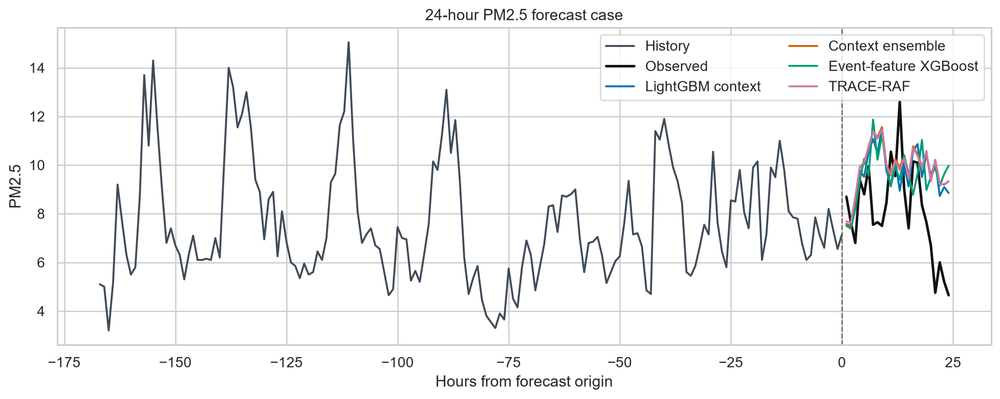

# TRACE-RAF: Trust-Gated Residual Retrieval for Auditable PM2.5 Forecasting

Official repository for the paper:

**TRACE-RAF: Trust-Gated Residual Analog Correction with Evidence-Preserving Retrieval for Auditable PM2.5 Forecasting**

**Sabbir Hossain Showrav**, **Md. Iftekharul Mobin**, and **Mahamodul Hasan Mahadi**<br>
Department of Computer Science, Faculty of Science and Technology<br>
American International University-Bangladesh, Dhaka, Bangladesh

Implementation and reproducibility materials are provided in this repository.

---

## 📋 Abstract

Short-horizon PM2.5 forecasting must account for pollutant persistence,
meteorology, calendar effects, sparse environmental events, and temporal
distribution shift without introducing leakage. **TRACE-RAF** is a supervised
Trust-Gated Residual Analog Correction method for auditable 24-hour forecasting.
It aligns source-preserving EPA and NOAA records, retrieves only causally
eligible historical analogues, and applies a validation-trained reliability gate
to out-of-fold residual trajectories instead of directly copying analogue
futures.

The evaluation covers Los Angeles County from 2019 through 2025 using a 168-hour
lookback and a final chronological holdout of 2,460 forecast origins. TRACE-RAF
records MSE 40.062, MAE 4.134, RMSE 6.329, and R² 0.444. Ridge is the strongest
tested model overall with MSE 39.144. TRACE-RAF remains competitive with the
nonlinear context baselines, but no favorable TRACE comparison survives the
family-wise Holm adjustment. The contribution is therefore an auditable,
leakage-safe residual-retrieval architecture and a reproducible evaluation—not a
claim of universal baseline superiority or causal event effects.

---

## 📑 Table of Contents

- [Overview](#-overview)
- [Key Contributions](#-key-contributions)
- [Data and Experimental Design](#-data-and-experimental-design)
- [TRACE-RAF Architecture](#-trace-raf-architecture)
- [Installation](#-installation)
- [Reproducible Workflow](#-reproducible-workflow)
- [Results](#-results)
- [Auditability and Interpretation](#-auditability-and-interpretation)
- [Repository Structure](#-repository-structure)
- [Citation](#-citation)
- [License](#-license)
- [Contact](#-contact)

---

## 🔍 Overview

This repository contains code and research artifacts for:

- source-audited alignment of EPA PM2.5, NOAA GHCNh weather, calendar, and
  NOAA Storm Events records;
- leakage-safe historical analogue retrieval with explicit temporal embargoes;
- random, calendar, cosine, and event-context retrieval controls;
- direct, residual-corrected, neural, and frozen-TSFM forecasting paths;
- TRACE-RAF out-of-fold residual memory and validation-trained trust gating;
- drift, uncertainty, retrieval, and prediction-level evidence records;
- paired block-bootstrap and HAC-corrected Diebold-Mariano comparisons;
- multiplicity control with Holm adjustment;
- Kaggle-first training, artifact verification, and paper-claim verification.

TRACE-RAF is inspired by the external-memory principle used in
retrieval-augmented forecasting, but it is **not** a reproduction of TimeRAF's
learned dual encoder or Channel Prompting mechanism. The proposed forecast is a
supervised residual-correction model; frozen Chronos-Bolt is evaluated as a
separate benchmark.

---

## 🎯 Key Contributions

1. **Source-Audited Context Builder (SACB):** Aligns official PM2.5,
   meteorological, calendar, and event records while preserving source,
   coverage, and availability metadata.
2. **Leakage-Safe Event-Context Retriever (LSER):** Retrieves only candidates
   whose complete target ends before the query lookback begins, with separately
   auditable PM2.5, weather, calendar, and event similarity channels.
3. **Trust-Gated Residual Analog Correction (TRACE):** Retrieves expanding-window
   out-of-fold residual trajectories and applies a bounded, validation-trained
   gate rather than replacing the base forecast with a raw analogue future.
4. **Drift-Aware Forecast and Evidence Head (DFEH):** Unifies direct,
   residual-corrected, and frozen-TSFM paths with drift diagnostics,
   probabilistic checks, and machine-readable forecast evidence.

---

## 📊 Data and Experimental Design

The pipeline uses source-preserving public records.

| Source | Role | Study use |
| :--- | :--- | :--- |
| [US EPA AirData](https://aqs.epa.gov/aqsweb/airdata/download_files.html) | Hourly PM2.5, parameter 88101 | County-level forecasting target |
| [NOAA GHCNh](https://doi.org/10.25921/jp3d-3v19) | Hourly meteorological observations | Weather context |
| [NOAA Storm Events](https://www.ncei.noaa.gov/stormevents/ftp.jsp) | Source-verified hazard records | Retrospective event-context sensitivity |
| NOAA HMS cache, when supplied | Fire and smoke evidence | Optional strict-timestamp extension |

### Experimental Summary

| Attribute | Value |
| :--- | :--- |
| Study region | Los Angeles County, California |
| Study period | 1 January 2019–31 December 2025 |
| Forecast target | 24 hourly PM2.5 values |
| Lookback window | 168 hours |
| Training origins | 45,784 |
| Validation origins | 7,950 |
| Final-holdout origins | 2,460 |
| Primary retrieval size | `k = 8` |
| Primary knowledge-base stride | 24 hours |
| Bootstrap design | 5,000 resamples in 168-hour blocks |
| Frozen TSFM | `amazon/chronos-bolt-small` |

The final holdout begins on **25 August 2025** and is excluded from model and
hyperparameter selection. January 2025 belongs to validation and is reported
only as a development-stress analysis.

NOAA Storm Events does not provide machine-readable publication timestamps.
The study therefore records event start as a declared retrospective
availability assumption. Event-conditioned results are sensitivity analyses,
not strict operational forecasts. A strict operational run requires a cache
with genuine `published_at` values.

Raw downloads are cached under `data/raw/`. Generated datasets and large model
outputs are ignored by Git; they can be regenerated or supplied through a
manifest-backed publication archive.

---

## 🏗 TRACE-RAF Architecture

### Figure 1: End-to-End Framework

<p align="center">
  
</p>

**Figure 1.** Official-source data pass through SACB, causally eligible
training-history candidates are ranked by LSER, retrieved out-of-fold residuals
are scaled by the TRACE trust gate, and DFEH produces the 24-hour forecast with
prediction-level evidence.

### 1. Source-Audited Context Builder

- **Inputs:** PM2.5 history, weather, calendar, and event records
- **Base context:** 46 dimensions before event features
- **Full context:** 85 aligned dimensions
- **Controls:** coverage checks, source identity, timestamps, and declared
  availability mode

### 2. Leakage-Safe Event-Context Retriever

- **Eligibility rule:** `candidate_target_end < query_input_start`
- **Similarity channels:** PM2.5 shape, weather, calendar, and events
- **Primary retrieval size:** eight historical candidates
- **Evidence:** selected candidate IDs, channel contributions, scores,
  fallback state, and retrieved trajectories

### 3. Trust-Gated Residual Analog Correction

- **Base forecast:** validation-selected convex LightGBM–XGBoost context
  ensemble
- **Memory target:** expanding-window out-of-fold forecast residuals
- **Gate inputs:** 18 variables describing retrieval quality, model
  disagreement, correction spread, event context, and distribution shift
- **Update:** `TRACE forecast = base forecast + gate × residual correction`

### 4. Drift-Aware Forecast and Evidence Head

- direct and residual-corrected supervised forecasts;
- frozen Chronos-Bolt and output-space retrieval controls;
- mean, variance, weather, similarity, and event-mix shift diagnostics;
- probabilistic interval and exceedance diagnostics;
- prediction-level evidence retained for independent reconstruction.

### Algorithm 1: TRACE-RAF Forward Pass

```text
Require: forecast origin t, 168-hour query context, training-history memory

1: Build the source-audited query context with SACB
2: Exclude every candidate whose target does not end before the query lookback
3: Rank eligible candidates with LSER and retain retrieval evidence
4: Generate the supervised base forecast
5: Retrieve and aggregate out-of-fold residual trajectories
6: Estimate origin-level correction reliability with the validation-trained gate
7: Apply the bounded residual correction to the base forecast
8: Emit the 24-hour forecast, drift diagnostics, and machine-readable evidence
```

---

## 🛠 Installation

### Requirements

- Python 3.12 recommended
- NumPy, pandas, SciPy, scikit-learn, and XGBoost
- PyArrow for persisted tables
- Matplotlib, seaborn, and SHAP for analysis
- Optional: LightGBM, PyTorch, Transformers, and Chronos Forecasting

### Setup

```bash
git clone https://github.com/shasabbir/event-time-raf.git
cd event-time-raf

python -m venv .venv

# Linux/macOS
source .venv/bin/activate

# Windows PowerShell
# .\.venv\Scripts\Activate.ps1

python -m pip install --upgrade pip
python -m pip install -r requirements.txt
```

Install the optional neural and frozen-TSFM dependencies for the full
publication workflow:

```bash
python -m pip install -r requirements-optional.txt
```

`requirements-publication-lock.txt` records the exact package versions used by
the audited publication run.

---

## 🔁 Reproducible Workflow

### Local Unit Tests

Linux/macOS:

```bash
PYTHONPATH=src pytest -q tests
```

Windows PowerShell:

```powershell
$env:PYTHONPATH = "src"
pytest -q tests
```

### Kaggle Notebook Order

1. **`notebooks/01_event_timeraf_kaggle_pipeline.ipynb`** builds the aligned
   dataset, trains the declared model family, evaluates the final holdout, and
   exports a publication-candidate ZIP.
2. **`notebooks/02_results_and_figures.ipynb`** authenticates the archive,
   recomputes metrics and statistical tests from stored predictions, verifies
   the TRACE decomposition, and regenerates result figures.
3. **`notebooks/03_paper_claim_verification.ipynb`** checks run-ID consistency,
   completeness, and the exact tables supporting manuscript claims.

The main notebook defaults to the full publication profile:

```text
RUN_TSF_MODEL = True
FINAL_EXPERIMENT = True
RETRIEVAL_EVIDENCE_REVIEWED = True
```

For the official NOAA Storm Events cache workflow, run
`notebooks/00_prepare_official_noaa_storm_cache.ipynb`, upload the resulting ZIP
as a private Kaggle Dataset, and attach it to Notebook 01. Each source archive
is checked against the generated URL manifest and SHA-256 hashes.

<details>
<summary><strong>Engineering-only modes</strong></summary>

- Set `REQUIRE_EVENTS = False` for an event-free engineering run. It cannot
  support event-aware paper claims.
- Set `REQUIRE_STRICT_EVENT_AVAILABILITY = True` to require genuine event
  publication timestamps.
- Disabling `RUN_TSF_MODEL`, `FINAL_EXPERIMENT`, or
  `RETRIEVAL_EVIDENCE_REVIEWED` produces an engineering run, not a final
  publication run.

</details>

---

## 📈 Results

### Final-Holdout Performance

The table reports the common 2,460-origin final holdout. Lower MSE, MAE, and
RMSE are better; higher R² is better.

| Model | MSE | MAE | RMSE | R² |
| :--- | ---: | ---: | ---: | ---: |
| Hour–month climatology | 73.915 | 6.398 | 8.597 | -0.025 |
| Persistence | 57.327 | 4.840 | 7.571 | 0.205 |
| XGBoost PM2.5 | 44.547 | 4.317 | 6.674 | 0.382 |
| XGBoost context | 42.006 | 4.233 | 6.481 | 0.417 |
| **Ridge context** | **39.144** | **4.079** | **6.257** | **0.457** |
| LightGBM context | 40.089 | 4.151 | 6.332 | 0.444 |
| DLinear | 40.305 | 4.097 | 6.349 | 0.441 |
| PatchTST | 40.766 | 4.111 | 6.385 | 0.435 |
| LSTM | 39.978 | 4.095 | 6.323 | 0.445 |
| Context ensemble | 40.115 | 4.156 | 6.334 | 0.444 |
| Event-feature XGBoost | 41.193 | 4.148 | 6.418 | 0.429 |
| **TRACE-RAF** | **40.062** | **4.134** | **6.329** | **0.444** |
| TRACE-RAF without events | 40.062 | 4.135 | 6.329 | 0.444 |
| Frozen Chronos-Bolt | 47.534 | 4.202 | 6.894 | 0.341 |
| Chronos + event retrieval | 48.609 | 4.574 | 6.972 | 0.326 |
| Validation drift router | 41.466 | 4.190 | 6.439 | 0.425 |

### Mechanism Ladder

| Variant | Integration rule | MSE | MAE |
| :--- | :--- | ---: | ---: |
| Base context ensemble | No retrieval correction | 40.115 | 4.156 |
| Raw analogue fusion | Validation selects weight 0.00 | 40.115 | 4.156 |
| Ungated residual transfer | Fixed strength 1.00 | 44.959 | 4.250 |
| Constant residual transfer | Validation selects strength 0.00 | 40.115 | 4.156 |
| **TRACE-RAF** | Learned gate; selected strength 0.25 | **40.062** | **4.134** |

Validation rejects raw-future fusion and constant residual transfer, while the
learned gate applies a small, origin-specific correction. The TRACE-RAF versus
base-ensemble MAE difference is nominally favorable, but no favorable TRACE
comparison remains significant after Holm adjustment over the declared
comparison family.

### Horizon-Wise Error

<p align="center">
  
  
</p>

**Figure 2.** MSE and MAE across the 24 forecast horizons for the principal
comparison models.

---

## 🔎 Auditability and Interpretation

The publication workflow is designed so reported values can be checked from
stored predictions rather than trusted as notebook output alone.

- Every result table carries a run ID and event-availability mode.
- The run manifest records artifact sizes and SHA-256 hashes.
- Notebook 02 independently recomputes saved metrics and statistical tests.
- TRACE predictions are reconstructed as `base + gate × residual correction`.
- Candidate eligibility, retrieval channel scores, selected event state,
  fallbacks, drift indicators, and correction components are retained.
- The audited run verifies 106 manifest-listed artifacts, 43 result tables,
  56,194 forecast windows, and 59,040 final-holdout forecast points.

<p align="center">
  
  
</p>

**Figure 3.** Representative prediction-level evidence views for ordinary and
event-context origins. These records support traceability; they are not causal
attributions to weather or event records.

### Evidence-Bounded Interpretation

- Ridge is the strongest tested model on the headline final-holdout metrics.
- TRACE-RAF is competitive with the nonlinear context baselines, but it does
  not establish universal superiority.
- The event-free TRACE result is nearly identical to the event-aware result, so
  an aggregate event-specific gain is not established.
- Adding event retrieval to the tested frozen Chronos-Bolt output-space fusion
  worsens MAE after multiplicity adjustment; this does not generalize to all
  retrieval-augmented TSFMs.
- Drift indicators diagnose distributional change; they do not prove that the
  system adapts to concept drift.

---

## 📁 Repository Structure

```text
event-time-raf/
├── configs/                  # Experiment configuration
├── data/                     # Raw-cache and generated-data locations
├── notebooks/                # Training, verification, and claim-audit notebooks
├── outputs/                  # Generated artifacts; large outputs are ignored
├── docs/assets/              # Public README figures
├── src/event_timeraf/        # Data, features, retrieval, models, and evaluation
├── tests/                    # Unit and leakage-safety tests
├── tools/                    # Packaging and notebook-build utilities
├── requirements.txt
├── requirements-optional.txt
├── requirements-publication-lock.txt
└── README.md
```

The experiment contract is encoded in the configuration and verification notebooks,
publication gates, and leakage rules.

---

## 📜 Citation

If you use this code or build on the TRACE-RAF methodology, please cite the
manuscript:

```bibtex
@misc{showrav2026traceraf,
  title  = {TRACE-RAF: Trust-Gated Residual Analog Correction with
            Evidence-Preserving Retrieval for Auditable PM2.5 Forecasting},
  author = {Showrav, Sabbir Hossain and Mobin, Md. Iftekharul and
            Mahadi, Mahamodul Hasan},
  year   = {2026},
  url    = {https://github.com/shasabbir/event-time-raf}
}
```

---

## 📄 License

No open-source license has been added to this repository. Unless a license is
provided, the code and research artifacts remain subject to the authors'
copyright.

---

## 🤝 Contact

For questions, reproducibility reports, or collaboration proposals, open a
[GitHub issue](https://github.com/shasabbir/event-time-raf/issues).
